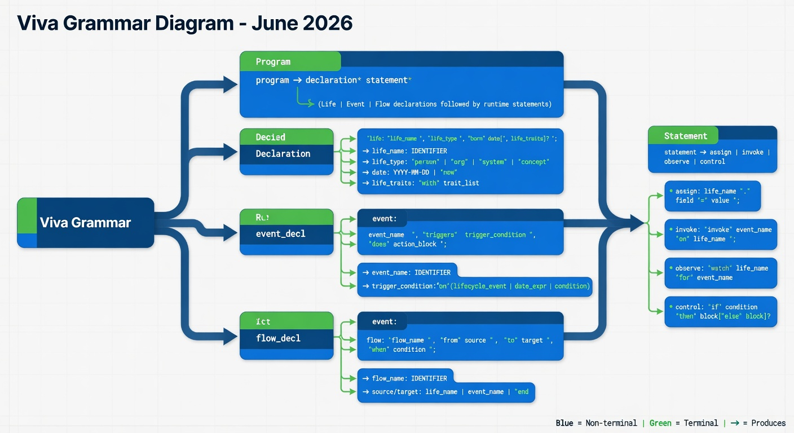

# Viva Grammar (Draft - June 2026)

This is an initial formal grammar for Viva, expressed in a PEG/EBNF-like notation for clarity. It is derived directly from the examples and description in the original (private) genesis document. The full history is in the private `viva_original` repository.

The grammar will be refined iteratively as we implement the parser and add more examples.

## High-Level Structure

A Viva program is a sequence of declarations (in any order, though typically lives first, then events, then flows).

```
program        = declaration+
declaration    = life_decl | event_decl | flow_decl
```

## Life Declarations

```
life_decl      = "life:" life_name "," life_type "," "born" year ( "," mortality )?
life_name      = identifier
life_type      = "man" | "woman" | "person" | identifier   ; extensible
year           = YEAR
mortality      = "mortality" "=" NAME   ; e.g. mortality=SSA_2023
; if omitted, default "SSA_2023" is assigned during parsing
; mortality table is used for death probability in the interpreter (future)
```

Example:
```
life: Paul, man, born 2005
```

## Event Declarations

```
event_decl     = "event:" event_name "," time_window "," probability
event_name     = identifier
time_window    = relative_future | absolute_year | at_age | after_event | starting_at_age | life_ref
relative_future = "in" "the" "next" number "years"
absolute_year   = "in" year | "year" year
at_age          = "at" "age" number
after_event     = ("in" number "years" | number "years") "after" (event_name | life_ref)
starting_at_age = "starting" "at" "age" number
year            = number   ; MVP: bare number. If <100 treated as relative offset from start_year (year N = start_year + N-1). Absolute 4-digit years kept as-is. Full date precision deferred.
probability    = "uniform annual probability" number "%" | "with probability" number "%" | ...
```

Example:
```
event: child_birth, in the next 10 years, uniform annual probability 80%
```

## Flow Declarations

```
flow_decl      = "flow:" flow_name "," amount "," trigger "," duration?
flow_name      = identifier
amount         = signed_number unit? frequency?   ; e.g. -20k per year , -20k annually , 1k monthly
unit           = "k" | "m" | ...       ; thousands, millions; parser normalizes to base currency units
trigger        = "upon" (event_ref | life_ref ( "." | "'s" ) ( "death" | "birth" )) | "recurring" period
duration       = "for" number "years" | "for" "life" | "until" (event_ref | life_ref ( "." | "'s" ) ( "death" | "birth" )) | "until" number unit "total" | ...   ; "until 100k total" is cumulative cap; "for life" = until death of relevant life
period         = "per month" | "per year" | "monthly" | "annually" | ...   ; "per month" assumes 1st of the month unless otherwise specified
; "monthly" and "annually" are synonyms for "per month" and "per year"
; from/until compact: from year X (to | until) year Y ; from year X (for | until) ...
; Amounts support words: thousand/k , million/m , billion/b , trillion/t (case-insensitive)
event_ref      = identifier
life_ref       = identifier
signed_number  = ("+" | "-")? number
number         = digit+ ("." digit+)?
identifier     = [a-zA-Z_][a-zA-Z0-9_]*
```

Examples:
```
flow: child_expense, -20k, upon child_birth, for 20 years
flow: saving, 1k per month
flow: insurance, 1m, upon Paul.death
flow: allowance, 5k annually, from Paul's birth
flow: payout, 1m, from year 2027 until year 2029
flow: big, 3 million per year
```

## Comments and Whitespace

```
comment        = "#" .* 
whitespace     = (space | tab | newline | comment)+
```

## Notes / Open Questions for Grammar

- **Dates (MVP simplified)**: Bare year only (e.g. `born 2005`, `in 2028`, `year 2025`). The interpreter resolves every transaction to January 1 of that year (`date(year, 1, 1)` from datetime). This lets us get a working parser + interpreter quickly.
  - Deferred (full spec preserved in roadmap.md "Deferred / Future Requirements"): any common formats (mm/dd/yyyy, "April 3, 2019", etc.), per-month day defaults (1st unless specified), ambiguity warnings for mm/dd vs dd/mm, natural language dates, full date objects with month/day.
- Amounts: Support k/m scaling (e.g. 20k, 1.5m), signs (+/-), decimals (1.5k). MVP: all USD (see currency field in output). Multicurrency deferred.
- Probabilities: "uniform annual probability N%", "probability 5% per year", "probability 100%". Richer distributions later?
- Multiple lives: Reference attributes (Paul.death / Paul's death, Baby.birth / Baby's birth), scoped age like "at age 18 for Child". Birth is deterministic (exact born year); death is stochastic (mortality table).
- Time model: Currently discrete years (MVP). Finer granularity + continuous later.
- Relative years: Numbers <100 in "year N" contexts are relative offsets (`year N` = start_year + (N-1)).
- "per month" / periods (MVP): Grammar accepts "per month", "per year". Interpreter emits one yearly entry (Jan 1) per recurrence year. "until 100k total" (cumulative cap) and "for life" also appear in examples and must be supported in duration.
- "until 100k total" and "for life": Extend duration production beyond "for N years" | "until event".
- Identifiers: Case sensitive? Reserved words?
- Big numbers: k/thousand, m/million, b/billion, t/trillion (case-insensitive, attached or word form) normalized by parser.
- Output model: list[dict['date': date (Jan1 of year), 'name': str, 'amount': float, 'currency': 'USD']]  (MVP)

## Visual Diagram

The grammar can be visualized as a hierarchical mindmap diagram.

**Interactive version (Mermaid):**

```mermaid
mindmap
  root((Viva Grammar))
    Program
      one or more declarations
    Declaration
      Life Declaration
        life, name, type, born year [, mortality=TABLE]
        ; default mortality table "SSA_2023" assigned if omitted
      Event Declaration
        event, name, time window, probability
      Flow Declaration
        flow, name, amount, trigger, optional duration
    Life Declaration Details
      life_name
        identifier
      life_type
        man, woman, person, or identifier
      date
        year (MVP simplification)
          bare year e.g. 2005 or 2028
          resolves to Python date(year, 1, 1)
          full dates, natural language, mm/dd ambiguity warnings, per-month days: deferred (see roadmap)
    Event Declaration Details
      event_name
        identifier
      time_window
        relative_future | absolute_year | at_age | after_event | starting_at_age
          e.g. 'in the next 10 years', 'in 2028', 'year 2025', 'at age 65', 'in 3 years after start', 'starting at age 80'
      probability
        uniform annual probability N percent
        or with probability N percent
    Flow Declaration Details
      flow_name
        identifier
      amount
        signed_number with optional unit
      unit
        k, m, etc.
      trigger
        upon event_ref
        upon life_ref.death
        recurring period
      duration / windows (MVP)
        for N years | for life | until event_ref | until N (k/m) total
        from year YYYY [, for N years | , until year YYYY | , to year YYYY]
        after N years [, for M years]
          "until 100k total" = stop after cumulative amount reached
          "for life" supported in interpreter later
          "from year X for N years" and "after N years for M years" supported for deterministic windows
      period (MVP)
        per month | per year
          interpreter emits one entry per year (Jan 1) for now
          full per-period dated entries + 1st-of-month default: deferred (roadmap)
      event_ref
        identifier
      life_ref
        identifier
      signed_number
        optional sign plus number
      number
        digits with optional decimal part
      identifier
        letter or underscore, then alphanumeric
    Whitespace and Comments
      comment starts with hash
      whitespace includes spaces, tabs, newlines, comments
```

**Static image version:**



To view/edit the interactive diagram:
- Paste the Mermaid code into https://mermaid.live
- Or open `grammar-diagram.mmd` in VS Code / GitHub / any Mermaid-supporting editor (it will render live).

## Next for Grammar

(See the "Lark Grammar (Current Implementation)" section below — the parser has been fully implemented for the MVP.)

See `roadmap.md` Phase 1-4 + the Deferred Requirements list. This MVP approach lets us reach a working end-to-end (parse → generateFlowEngine) much faster.

This is a living document — amend as we go.

---

## Lark Grammar (Current Implementation)

The high-level EBNF above was turned into an **executable Lark grammar** (Earley parser for flexibility with the syntax we actually use).

The grammar is defined in the separate file `src/viva/grammars/viva.lark` (this is the canonical source of truth). `LarkParser` loads it by default, but you can also pass a custom grammar string to its constructor:

```python
from viva.parsers.lark_parser import LarkParser
p = LarkParser()  # uses grammars/viva.lark
p2 = LarkParser(grammar=my_custom_grammar)
```

### Characteristics (MVP)
- Year-only dates (`year` terminal = 1-4 digits). Numbers <100 in year contexts are relative offsets from `start_year` (`year N` → `start_year + (N-1)`).
- Events are flexible: time window and/or probability (in either order). Time windows support life birth/death refs (including `'s` possessive) and "N years after".
- Amounts can be followed directly by period: `150k per year`, `1k per month`, `3 million`, `2 trillion`.
- Flows support chained modifiers: `upon`/`from`/`until`/`after` life_ref.death or .birth (or 's form), compact `from year X to/until year Y`.
- k/m/b/t + full words (thousand/million/billion/trillion, case-insensitive) scaling applied in Transformer.
- Matches current example files + new birth/relative/big-num syntax.

### Full Lark Grammar

```lark
start: program
program: declaration+
declaration: life_decl | event_decl | flow_decl

life_decl: "life" ":" NAME "," life_type "," "born" year ( "," mortality )?
life_type: MAN | WOMAN | PERSON | NAME
MAN: "man"
WOMAN: "woman"
PERSON: "person"

mortality: "mortality" "=" NAME

event_decl: "event" ":" NAME ( "," event_detail )+
event_detail: time_window | probability

time_window: relative_future
           | absolute_year
           | at_age
           | after_event
           | starting_at_age
           | life_ref

relative_future: "in" "the" "next" NUMBER "years"
absolute_year: "in" year | "year" year
at_age: "at" "age" NUMBER
after_event: in_after | bare_after
in_after: "in" NUMBER "years" "after" after_target
bare_after: NUMBER "years" "after" after_target
after_target: NAME | NAME "." DEATH | NAME "." BIRTH | NAME APOS_S DEATH | NAME APOS_S BIRTH
starting_at_age: "starting" "at" "age" NUMBER

probability: "uniform" "annual" "probability" NUMBER "%"
           | "probability" NUMBER "%" ("per" "year")?
           | "with" "probability" NUMBER "%"

flow_decl: "flow" ":" NAME "," flow_amount ( "," flow_modifier )*

flow_amount: SIGNED_NUMBER UNIT? frequency?
flow_modifier: upon_mod | until_mod | for_mod | starting_mod | from_until_mod | from_to_mod | from_mod | after_mod | to_mod

upon_mod: "upon" upon_target
upon_target: NAME | NAME "." DEATH | NAME "." BIRTH | NAME APOS_S DEATH | NAME APOS_S BIRTH
DEATH: "death"
BIRTH: "birth"
APOS_S: "'s"

until_mod: "until" until_target
until_target: NAME | NAME "." DEATH | NAME "." BIRTH | NAME APOS_S DEATH | NAME APOS_S BIRTH | total_target | "year" year
total_target: NUMBER "total" | NUMBER UNIT "total"

for_mod: "for" for_target
for_target: NUMBER "years" | LIFE
LIFE: "life"

starting_mod: "starting" "at" "age" NUMBER

from_mod: "from" from_target
from_target: from_year | from_death | from_birth
from_year: "year" year
from_death: dot_death | apos_death
from_birth: dot_birth | apos_birth
dot_death: NAME "." DEATH
apos_death: NAME APOS_S DEATH
dot_birth: NAME "." BIRTH
apos_birth: NAME APOS_S BIRTH
from_to_mod: "from" "year" year "to" "year" year
from_until_mod: "from" "year" year "until" "year" year
after_mod: "after" NUMBER "years"

to_mod: "to" "year" year

life_ref: NAME "." (DEATH | BIRTH) | NAME APOS_S (DEATH | BIRTH)

MONTHLY: "monthly"
YEARLY: "annually"
per_month: "per" "month"
per_year: "per" "year"
frequency: per_month | per_year | MONTHLY | YEARLY

year: YEAR
NAME: /[a-zA-Z0-9_][a-zA-Z0-9_]*/
YEAR: /\d{1,4}/
NUMBER: /\d+(?:[_,](?=\d)\d+)*(\.\d+(?:[_,](?=\d)\d+)*)?/
SIGNED_NUMBER: /[-+]?/ NUMBER
UNIT: /(?:thousand|million|billion|trillion|[kmbt])/i

%import common.WS
%ignore WS
COMMENT: /#[^\n]*/
%ignore COMMENT
```

(The canonical source of truth is `src/viva/grammars/viva.lark`. The full content is also shown below for reference in the docs.)

### Syntactic Trees from the Lark Grammar

The most direct way to "see the grammar in action" as a syntactic tree is to use the raw Lark parse tree:

```python
from viva import get_parse_tree

tree = get_parse_tree(open("examples/example_seminal.viva").read())
print(tree.pretty())
```

Example output (structure only; exact labels depend on how Lark represents literals/rules):

```
program
  declaration
    life_decl
      Paul
      life_typeman
      year2005
  declaration
    event_decl
      child_birth
      event_detail
        time_window
          relative_future10
      event_detail
        probability80
  declaration
    flow_decl
      child_expense
      flow_amount
        -20
        k
      flow_modifier
        upon_mod
          upon_targetchild_birth
      flow_modifier
        for_mod
          for_target20
  ...
```

This tree shows exactly how the Lark grammar tokenized and hierarchically structured your Viva source (the "syntactic tree").

- `get_parse_tree(source)` → raw `lark.Tree` (concrete syntax tree)
- `parse(source)` → high-level `Program` AST (recommended for most uses; the Transformer turns the above into nice dataclasses with scaled amounts etc.)

Both are exported at the top level: `from viva import get_parse_tree, parse`

### Visual Tree Diagram of the Lark Grammar

**Interactive Mermaid mindmap** (live version of the grammar structure):

```mermaid
mindmap
  root((Viva Lark Grammar (MVP)))
    program
      start rule
      declaration+
    declaration
      life_decl | event_decl | flow_decl
    Life Declarations
      life_decl
        "life" ":" NAME "," life_type "," "born" year
      life_type
        MAN | WOMAN | PERSON | NAME
      MAN: "man"
      WOMAN: "woman"
      PERSON: "person"
      year
        YEAR
    Event Declarations
      event_decl
        "event" ":" NAME ( "," event_detail )+
      event_detail
        time_window | probability
      time_window
        relative_future | absolute_year | at_age | after_event | starting_at_age
      probability
        various forms with NUMBER "%"
    Flow Declarations
      flow_decl
        "flow" ":" NAME "," flow_amount ( "," flow_modifier )*
      flow_amount
        SIGNED_NUMBER UNIT? ("per" period)?
      flow_modifier
        upon / until / for / starting
    Terminals & Lexer
      NAME, YEAR, NUMBER, SIGNED_NUMBER, UNIT, MONTH, etc.
      regex for identifiers and numbers
    Ignored
      WS + # comments
    Getting Syntactic Trees
      get_parse_tree(source).pretty()
      → concrete Lark tree for any .viva program
```

**Editable source:** [lark-grammar-diagram.mmd](lark-grammar-diagram.mmd)

Render it at https://mermaid.live or in any Mermaid-capable editor.

(The previous `grammar-diagram.mmd` was for the pre-implementation EBNF mindmap.)

This combination (the grammar text + `get_parse_tree(...).pretty()` + the mindmap diagram) gives you a complete "syntactic tree" view of the current Lark grammar, both for the meta-grammar itself and for concrete Viva programs you write.

---

## Parser Abstraction Layer (Architecture)

To keep Viva's core independent of any specific parsing library, we use a small interface + implementation split:

### Key modules

- `viva/nodes.py` — Pure data classes (`Program`, `LifeDecl`, `EventDecl`, `FlowDecl`). Backend-agnostic.
- `viva/grammars/viva.lark` — The executable Lark grammar (the source of truth for syntax).
- `viva/parsers/base.py` — Abstract `Parser` base class + `ParseTree` protocol.
- `viva/parsers/lark_parser.py` — `LarkParser(Parser)` (the only file that imports `lark`). Accepts the grammar via its constructor.
- `viva/parser.py` — Public facade with `parse()`, `get_parse_tree()`, `generateFlowEngine()`, plus `set_default_parser()` / `get_default_parser()`.
- `viva/interpreter.py` — The simulation engine (`generateFlowEngine()` returns FlowEngine with params, param_distribs, getFlows, drawParamRealization, drawFlows).

### Using the abstract interface

```python
from viva.parsers.base import Parser
from viva.parsers.lark_parser import LarkParser
from viva.nodes import Program

p: Parser = LarkParser()
prog: Program = p.parse(viva_source)
raw_tree = p.get_parse_tree(viva_source)   # has .pretty()
```

### Swapping parsers at runtime

```python
from viva import set_default_parser
from my_custom_parser import MyPurePythonVivaParser

set_default_parser(MyPurePythonVivaParser())

# Now all calls to parse(), get_parse_tree(), and generateFlowEngine() use the new backend
engine = generateFlowEngine(source)  # returns FlowEngine
flows = engine.drawFlows(seed=42)
events = model["draw_flows"](seed=42)
```

You can also inspect or restore the current default:

```python
from viva import get_default_parser
current = get_default_parser()
```

This design (combined with the grammar living in `grammars/viva.lark` and being injectable into `LarkParser`) makes it straightforward to replace Lark in the future with a minimal custom implementation (removing the runtime dependency on Lark while keeping the public API and simulation logic unchanged).

### Public exports (from `viva`)

- `parse(source)` / `get_parse_tree(source)` / `generateFlowEngine(...)`
- `set_default_parser(parser)`, `get_default_parser()`
- `Parser`, `ParseTree`, `LarkParser` (for type hints and advanced use)
- The AST classes: `Program`, `LifeDecl`, `EventDecl`, `FlowDecl`
- `FlowEngine` (returned by generateFlowEngine)

`generateFlowEngine` returns a FlowEngine with:
.params, .param_distribs, .getFlows, .drawParamRealization, .drawFlows
(for MC/stats and controlled flow generation).

All Lark-specific details are encapsulated. The rest of the Viva codebase (including `simulate`) only talks to the `Parser` interface.